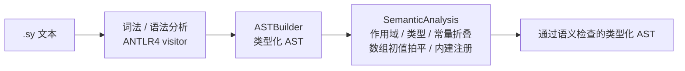
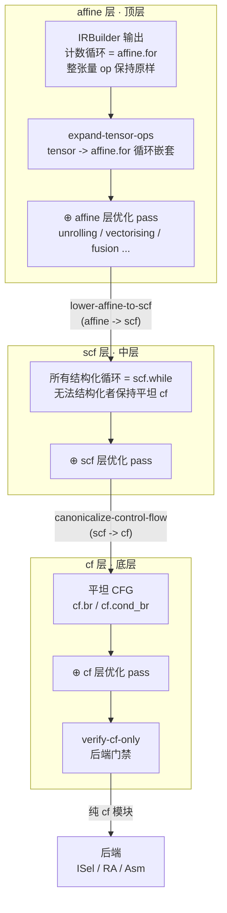
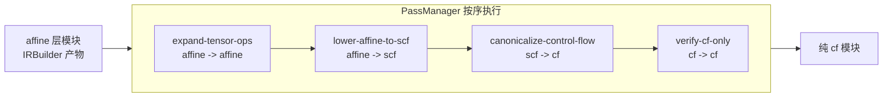
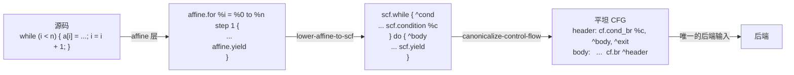
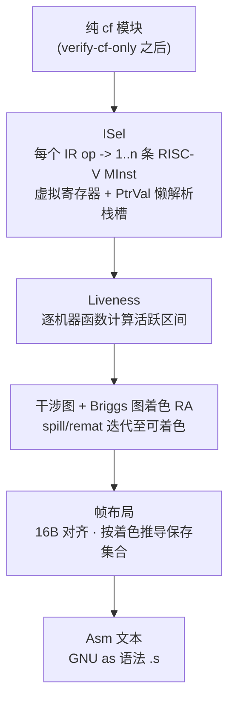

# SakuraCompiler 架构

一个自包含的 SysY -> RISC-V64gc 编译器。前端用 ANTLR4(visitor 模式),中端是一套
MLIR 风格的 SSA IR,由**中端 PassManager** 沿三个控制流层逐层下降
(`affine` -> `scf` -> `cf`);后端做 RISC-V 指令选择、图着色寄存器分配并输出
GNU `as` 兼容汇编。除内置的 ANTLR4 C++ 运行时外无第三方依赖。

## 总览

```mermaid
flowchart LR
    SRC[.sy 源文件] --> LEX[ANTLR4 词法 / 语法分析<br/>SysY.g4]
    LEX --> AST[ASTBuilder<br/>parse tree -> 类型化 AST]
    AST --> SEM[SemanticAnalysis<br/>作用域 / 类型 / 常量折叠]
    SEM --> IRB[IRBuilder<br/>AST -> MLIR 风格 IR<br/>affine 层]
    IRB --> PM[runMidEndPipeline<br/>PassManager 逐层下降<br/>affine -> scf -> cf]
    PM --> ISEL[ISel<br/>IR op -> RISC-V MInst]
    ISEL --> RA[图着色寄存器分配]
    RA --> ASM[Asm<br/>输出 RISC-V .s]

    style SRC fill:#fff,stroke:#999
    style LEX fill:#ffe9ad,stroke:#c9a227
    style AST fill:#ffe9ad,stroke:#c9a227
    style SEM fill:#ffe9ad,stroke:#c9a227
    style IRB fill:#c9e7ff,stroke:#3d7fb6
    style PM fill:#c9e7ff,stroke:#3d7fb6
    style ISEL fill:#d9f7d5,stroke:#58a84f
    style RA fill:#d9f7d5,stroke:#58a84f
    style ASM fill:#d9f7d5,stroke:#58a84f
```



`src/main.cpp` 只负责把三段高层流程接起来——前端、中端、后端。中端全部的降级与优化
策略都收敛在 `runMidEndPipeline()` 这一个调用里,**驱动里不出现任何单个 pass**。

## 源码布局

| 路径 | 职责 |
| ---- | ---- |
| `src/SysY.g4` | ANTLR4 文法(lexer + parser)。 |
| `src/common/Common.h` | `TypeCat`、`ConstVal`、IEEE-754 辅助、`CompileError`。 |
| `src/frontend/` | 类型化 AST + ANTLR visitor 构建 + 语义分析。 |
| `src/midend/ir/` | IR 容器(`Module`/`Function`/`BasicBlock`/`Instruction`)、dialect 元数据、MLIR 风格打印。 |
| `src/midend/irbuild/` | AST -> IR(规范计数循环直接产出 `affine.for`)。 |
| `src/midend/pass/` | `PassManager`、标准 pass 序列(`Passes`)、高层入口 `Pipeline`、`TensorLower`。 |
| `src/backend/` | `Machine`、`ISel`、`RA`、`Asm`。 |
| `src/main.cpp` | 驱动:`compiler <in.sy> [-S] [-o out.s] [--dump-ir/affine/scf/cf]`。 |

## 前端



`SemanticAnalysis` 在 AST 上原地做标注,要点:

- **作用域 / 类型** —— 块级符号表;每个表达式得到 `evalType`(`int`/`float`);
  整张量表达式打 `isTensorVal` 标记并记录静态形状 `tShape`。
- **TensorType 扩展** —— 逐元素 `+ - * / %`(标量提升 + 形状一致)、一元 `+ -`、
  秩二 `@` 矩阵乘;张量上的关系/逻辑运算是类型错误。张量初值按 rank 校验并按行主序
  拍平;张量形参第一维 `[]`(退化指针),返回张量的函数形状记录在函数上。
- **常量折叠** —— 表达式尽量折叠成 `ConstVal`;维度、大小与 const 初值必须可折叠。
- **内建函数** —— `getint`/`putch`/`getfloat`/`starttime`/`stoptime` 等按运行时
  签名注册;`starttime`/`stoptime` 映射到下划线导出的 `_sysy_starttime`/`_sysy_stoptime`。

## 中端:三层 IR + PassManager

中端是一套比照 MLIR 而非文本 LLVM IR 设计的 SSA CFG IR。每个 opcode 属于一个
**dialect**(`func` / `arith` / `cf` / `scf` / `affine` / `memref` / `tensor`),
打印时带限定名(`arith.addi`、`cf.cond_br`、`tensor.matmul`…);SSA 值类型为
`i32` / `f32` / `ptr`。扁平 `Op` 枚举仍是后端指令选择唯一 switch 的分发键。

控制流按**三层**组织,每层可独立优化,并由显式的 pass 管线逐层下降:



- **affine(顶层)** —— 可数循环是 `affine.for` region op;`expand-tensor-ops`
  把整张量 op 展开成 `affine.for` 嵌套,使该层成为一片统一的可数循环,便于 affine 层
  优化。
- **scf(中层)** —— `lower-affine-to-scf` 把每个 `affine.for` 改写成通用
  `scf.while` 形式;体内无法被 region op 捕获的循环(含 `return`/`break`/`continue`)
  从一开始就保持平坦 cf。
- **cf(底层)** —— `canonicalize-control-flow` 把所有 `scf.while` 拼回平坦 CFG。
  **这是后端唯一消费的形态**。

pass 序列由 `runMidEndPipeline()`(`src/midend/pass/Pipeline.cpp`)统一装配:



每个 `Pass` 声明 `inLayer()` / `outLayer()`;manager 执行时逐 pass 校验层标注,
顺序配错会立刻报错。新优化 pass 只需加进 `Pipeline.cpp` 的序列里,驱动不做任何改动。

### 分层打印

`Module::toString()` 输出标准 MLIR 风格文本:

```text
module {
  func.func private @putint(i32)
  func.func @main() -> i32 {
    %0 = arith.constant 10 : i32
    %1 = memref.alloca : i32
    memref.store %0, %1 : i32
    %2 = memref.load %1 : i32
    %3 = arith.addi %2, %0 : i32
    func.return %3
  }
}
```

层视图钩子(LayerView)在管线每次进入某一层时触发,支撑 `--dump-affine` /
`--dump-scf` / `--dump-cf`(`--dump-ir` 打印全部三层并跳过汇编输出)。

### 内存模型与张量 op

SysY 标量/数组常驻内存:局部量是 `memref.alloca` 栈对象,全局量是 `memref.global`,
数组形参是裸 `ptr`;`memref.gep` 做字节偏移寻址(所有标量元素 4 字节),
`memref.load`/`store` 经地址访存——4 字节栈槽模型一路保持到 RISC-V。

**张量值** = 缓冲区 + op 上记录的静态形状。IRBuilder 从不把它拆成标量,张量语义保持
一等公民(便于将来的向量化 pass 融合整数组表达式)。张量 op 把结果写入显式目标缓冲区:

```text
%t = memref.alloca : [4 x i32]
tensor.muli %t, @b, %c3 : (memref<4xi32>, i32) -> memref<4xi32>
tensor.addi @c, @a, %t : (memref<131072xi32>, memref<131072xi32>) -> memref<131072xi32>
```

### 一个循环如何穿过三层



`IRBuilder` 把干净的 `while (iv < ub) { ...; iv += step }` 直接抬升为 `affine.for`;
TensorLower 产出的循环也出生在 affine 层。凡不能被证明规范(或根本无法 region 化)的
代码,回退到 `scf.while` / 平坦 cf,因此结构化层里只会有良嵌套的循环。

返回张量的函数用隐藏 `sret` 结果缓冲区降级:IR 签名增加一个前导指针参数,
`return x` 变成 `tensor.copy` 写入该缓冲区,调用点在实参最前面传入自己的目标缓冲区。

## 后端



指令选择要点:

- alloca 的栈槽首次使用时懒解析(`PtrVal` 持有帧偏移);
- 从不被读取的 alloca 的 store 会被丢弃;`x - 0` -> `neg`、`0.0 - x` -> `fneg`;
  全常量比较在选择期折叠;
- **tensor/affine/scf op 不可能到达 ISel** —— `verify-cf-only` 会先抛错;即便到
  达,ISel 的兜底分支也会以 `internal: unhandled opcode` 拒绝。

寄存器分配是经典 Briggs 图着色:预着色物理寄存器(`a0-a7`/`fa0-fa7`、`t`/`ft` 临时、
被调用者保存 `s`/`fs`),simplify/spill 多轮迭代直到可着色,溢出的虚拟寄存器落栈;
caller/callee-saved 集合按最终着色推导,序言/尾声只保存实际用到的寄存器。

汇编输出面向 RISC-V64gc 的 GNU `as` 子集:16 字节栈对齐、调用前预留出参空间
(`ArgCursor` 先分配 `a0-a7`/`fa0-fa7`,溢出到 8 字节栈槽),帧/全局偏移直接折进
`lw`/`sw`(及 FP)形式。

## 测试

`cases/{functional,h_functional,performance2026,tensor}` 由宿主机上的
`build/compiler` 编译,汇编被推到 QEMU RISC-V Ubuntu 虚机内与 `libsysy_riscv.a`
汇编/链接后运行,stdout + 退出码与参考 `.out` 逐字节比对。
`scripts/test.sh` 与 `scripts/run.sh -qemu-test` 驱动整个流程;汇编与上次已验证结果
一致时经 `build/.verify_cache` 跳过虚机重跑。
